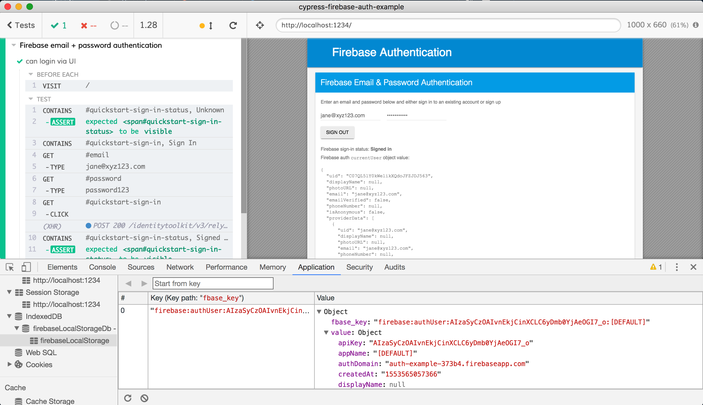

# cypress-firebase-auth-example

Firebase stores session information in the IndexedDB

To delete the key I am using [idb](https://github.com/jakearchibald/idb) to make interactions with IndexedDB more pleasant
